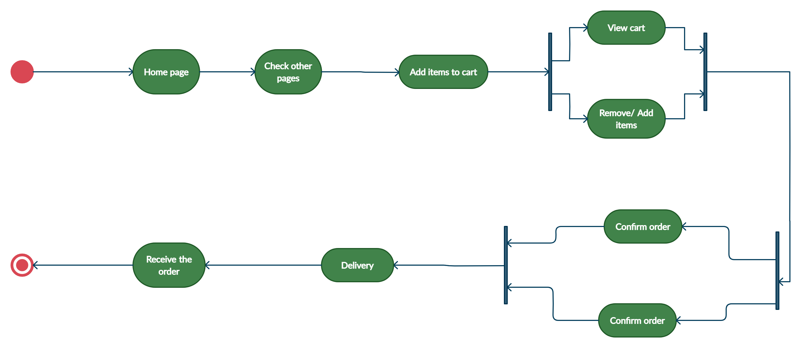

# Task 1.1
The consumer informed us that in Jordan there are not many web pages for booking meals online, so he decided to create an online web page that brings restaurants in one place to facilitate the meal ordering system.
What the consumer wants to see in the webpage:
1. Consumer need home page contain all restaurants in slide show
for every kitchen.
2. The consumer can visit the restaurants webpage for reservation.
3. Consumers can see every menu on the restaurant page
4. The customer can see all the orders in the shopping cart page and the consumer can cancel the order or the order.
5. The consumer needs to know how many meals he is ordering.
6. The consumer needs to see all the bill details

# Task 1.2
1. Add Unnecessary Features: According to the PMBoK library, functions that were not requested in the scope are called, gold plating is a source of additional risks (extra costs, human resources, time, testing, etc.) and takes into account negative control practices.
2. Poor group cohesion: Internal conflicts can make a group put speakers in each other's wheels.
3. Application is unstable: There are many reasons why applications may crash: browser incompatibility, incorrect memory usage, critical production errors, and more. What usually happens is that crashes disappoint customers and hinder the success of your app.
4. Learning time: The group can also take some time to study a new programming language, a large piece of software, or a hardware component.
5. Poor quality of the final product. Why does this happen? due to misunderstanding. If your web development organization does not understand the goals and functions of the product, your end product may be of poor quality.

# Task 1.3
## requirements:
1. The system must have a home page that contains all restaurants in the slide show for every kitchen.
2. The system must contain an href to go to the restaurants page to order.
3. The system must contain all the menus on the restaurants page
4. The system must contain all the orders in the shopping cart and the user can cancel the order or place the order.
5. The system must have a page to display the number of items a user has.
6. The system must have a page to display all invoice details

## Database design:
The kay of the object is cart, the
object conten Name and Price

Name ==> string

Price ==> integer 

We store the data in local storage called shopping cart, store the object's shopping cart, the object contains the name and price, it will take from the restaurant page the name and price of the meals, then we go to a function stored in local storage
## Wireframe
### Home page

The home page has a title with a logo that takes you to the home page, and the shopping cart takes you to the cart page to show you the bill and social media list. And we have a slideshow display all resturant.
### Restorant page

Restorant page contain menu to orders
## Activity Diagram

The activity diagram indicates the flow of management from the start point to the end point and shows the different decision paths that exist during the execution of the activity in our web page, the user will start on the home page, then he can go to the restaurant page after that he can order meals in the end go to cart page to make orders
# Coding and implementation technique
Due to the dynamic nature of projects within the web development industry, the following reasons are why we useing scrum:

1. Agile Scrum allows businesses to save time and money.
2. The Scrum method allows a project where it is difficult to define business requirements files to be developed successfully.
3. Sophisticated and fast-transfer features can be coded and checked using this technology, where the error can be easily corrected.

4. It is a technique of little discipline and insists on joint updating of work development through regular meetings. Thus, there may be a clear vision for the improvement of the project.
5. Like another agile method, this is an iterative addition. It requires regular feedback from the user.
6. Because of the short speed and regular reactions, it will become easier to deal with changes.
# Testing technique
Black box test: It may be a type of computer program check where the function of that system is not known. The test is performed without the inside information of the items